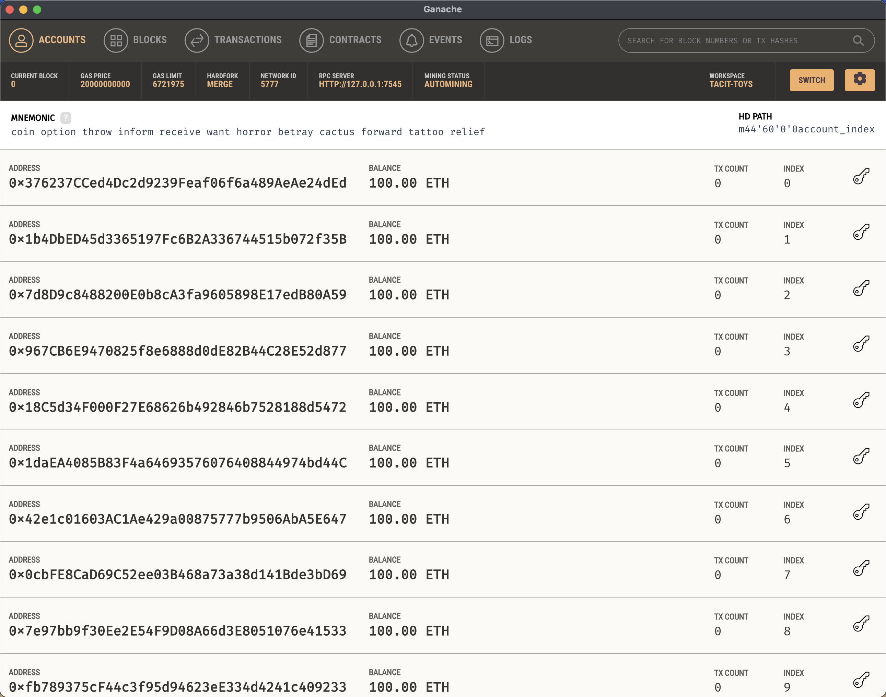
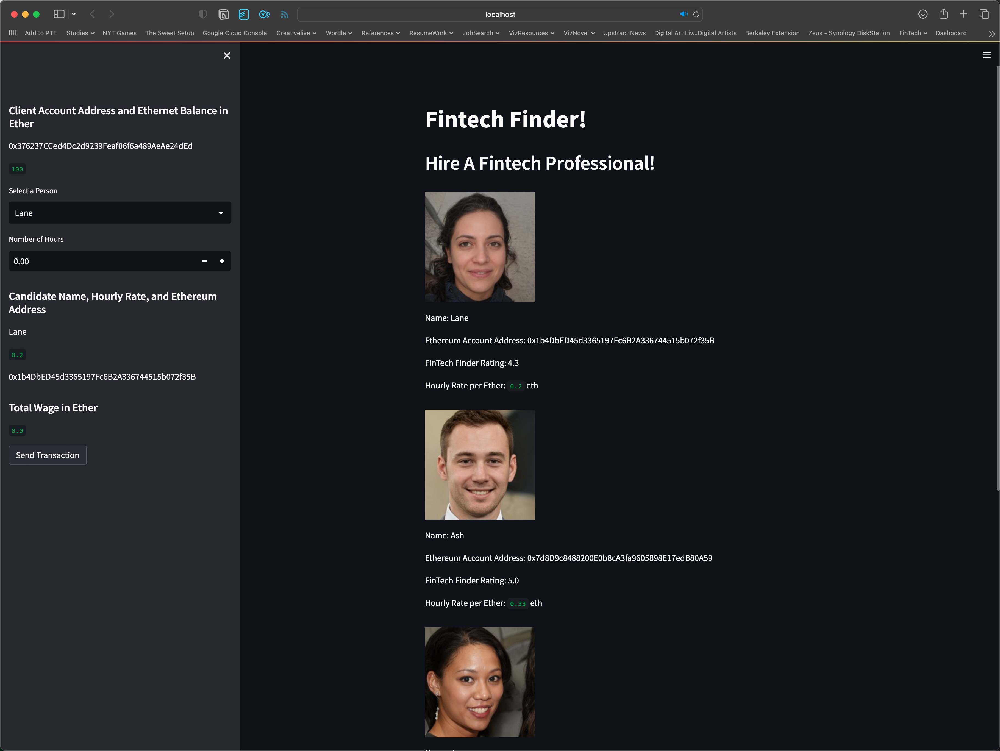
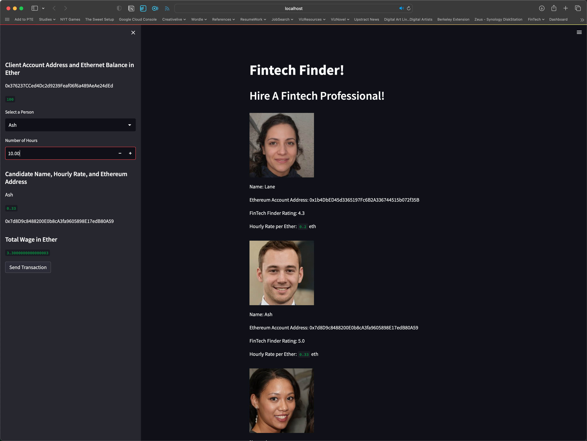
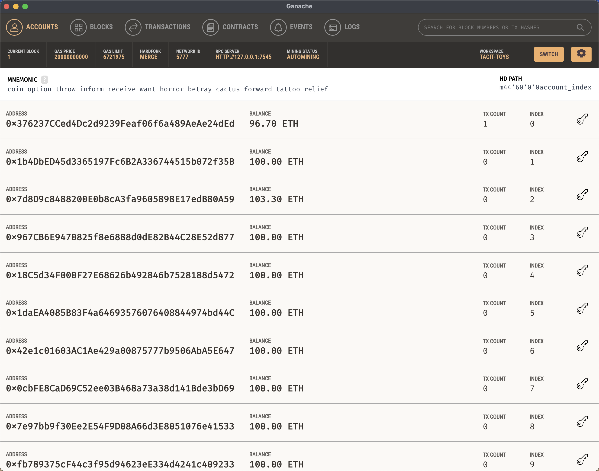
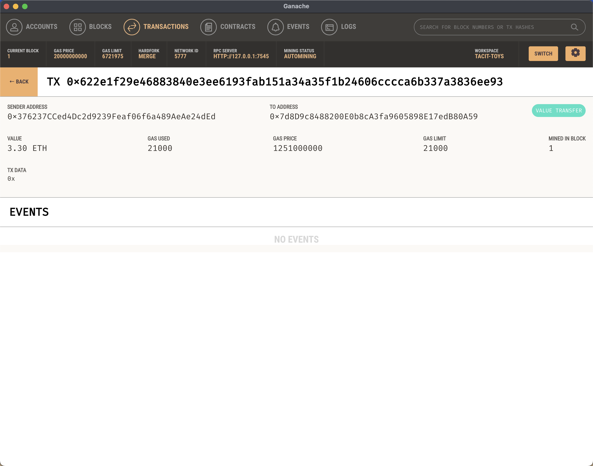

# Module 19 Challenge


## Introduction
The focus of this challenge was to implement code that enables an individual to send cyrptocurrency payments to fintech professionals.

## Technology
Code was developed using python version 3.9.16

The following python libraries were used:
* Streamlit  1.21.0
* web3 5.31.0
* bip44 0.1.3
* python-dotenv 0.21.0

While other versions of python and/or the above packages may work, no guarantee is made.

In addition, [Ganache](https://trufflesuite.com/ganache/) was used to provide a personal Ethereum blockchain to run the code against.

## Usage

1. Launch Ganache
2. Create a new workspace using the 'Quickstart' option
3. Use the 'save' button to save the workspace for future use/reference (if desired)
4. Copy the MNEMONIC shown at the top of the address list
5. In the same folder as the fintech_finder.py and crypto_wallet.py files create a new .env file and enter the following:
   ```
   MNEMONIC = '<<PASTE COPIED MENOMIC FORM GANACHE>>'
   ```
6. Launch the Fintech Finder application by running the following code from the command line:
   ```
   streamlit run fintech_finder.py
   ```
7. Once the application launches:
   1. update the account addresses found in the 'candidate_database' dictionary in the fintech_finder.py file to match any of the addresses shown in Ganache except for the first one
   2. select a candidate from the drop down list in the sidebar
   3. enter the number of hours to hire the individual for. There is a limited amount of ether in each account, so keep this to a low value such and confirm that you have enough eth to cover the cost
   4. click the 'Send Transaction' button
8. Once submitted the sidebar will update with a copy of the transaction hash from the submission
9.  In Ganache you may verify:
   1. new transaction under 'Transactions' tab that matches your submission
   2. reduction in your account balance (your account is the first listed)
   3. increase in the account balance for the selected FinTech professional

## Sample Images

After launching Ganache, showing 10 accounts with a balance of 100.00 ETH


After launching Fintech Finder application


After selection of desired Fintech Professional


After submitting transaction


View updated account balances in Ganache


View transaction details in Ganache



